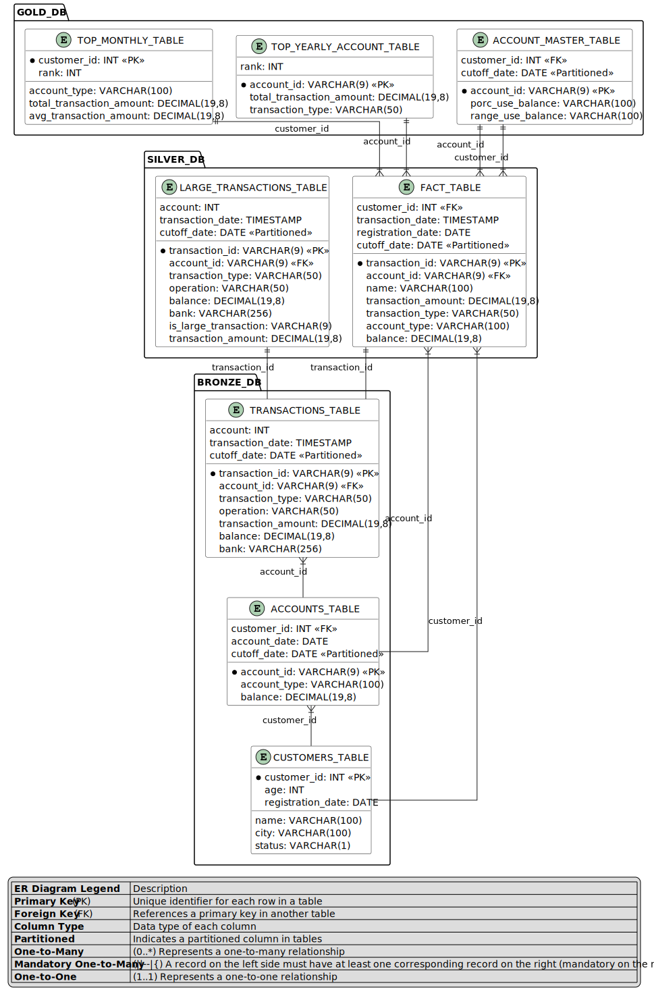
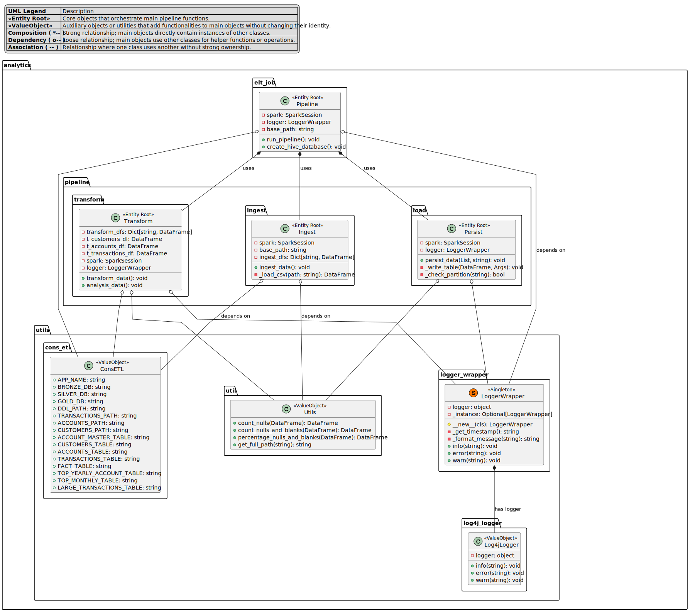

# ELT Process for Credit Approval and Monitoring

## Overview

A leading financial company specializing in offering credit to individuals and SMEs faces a complex and urgent challenge: optimizing and automating the real-time approval, monitoring, and tracking of loans. The company processes over 100,000 credit applications each month, which requires a robust ELT (Extract, Load, Transform) pipeline for efficient decision-making.

This project builds an ELT pipeline for processing and analyzing financial data, with a focus on improving the speed and accuracy of credit approval and monitoring.

## Analytics Process Overview

The Lambda Architecture is a deployment model for data processing that organizations use to combine a traditional batch pipeline with a fast real-time stream pipeline for data access.

The ELT process is divided into several stages, primarily utilizing the **Bronze**, **Silver**, and **Gold** layers from Medallion architecture to refine raw data through various transformations and aggregations. The stages include:

1. **Bronze Layer (Raw Data)**: Ingest raw data from CSV files into the system.
2. **Silver Layer (Cleaned Data)**: Transform and clean the data for better analysis, filtering and combining the raw data.
3. **Gold Layer (Aggregated Data)**: Finalized and aggregated data ready for reporting and decision-making.

## ER Diagram

The ER Diagram represents the high-level data architecture for the ELT process, highlighting the entities and their relationships.



## Tables Overview

The following tables are created and processed throughout the ELT pipeline:

### Bronze Layer
- `transactions`: Contains raw transaction data.
- `accounts`: Contains raw account data.
- `customers`: Contains raw customer data.

### Silver Layer
- `large_transactions`: Identifies large transactions above a certain threshold.
- `transactions_master`: Fact transaction data for analysis.

### Gold Layer
- `account_master`: Tracks balance usage by account.
- `top_amount_yearly_accounts`: Table tracking the top accounts by yearly transaction volume.
- `top_monthly_accounts`: Table for tracking the top accounts by monthly transaction volume.

---


## Class Diagram for PySpark ELT Process

The Class Diagram outlines the PySpark class structure used in the project, including the modules for extraction, transformation, and loading phases.



## Installation

To install the package, follow these steps:

1. **Install the package using the wheel file**:
    ```bash
    python -m pip install dist/leadsAnalytics-1.0.0-py3-none-any.whl
    ```

2. **Verify the installation**:
    ```bash
    python -m pip show leadsAnalytics
    ```

    This will display the package details, including the version and installation location.

## Load Raw Data

Before starting the ELT pipeline, ensure the raw data is placed in the appropriate directories (unzip if needed):
- **Transactions Data**: `./landing/transactions.csv`
- **Accounts Data**: `./landing/accounts.csv`
- **Customers Data**: `./landing/customers.csv`

### Input Directory Structure:
<pre>
/ELT
    /LeadsAnalytics
        /landing
            /transactions.csv
            /accounts.csv
            /customers.csv
</pre>

Make sure these files are correctly formatted with the necessary columns for transactions, accounts, and customers.

## SQL DDL

The **schema_ddl.sql** file contains the SQL Data Definition Language (DDL) for creating the required tables in the database. The following databases and tables will be created during the process:

- **Database**: `fin_bronze`, `fin_silver`, `fin_gold`
- **Tables**: 
    - `account_master`
    - `customers`
    - `accounts`
    - `transactions`
    - `transactions_master`
    - `top_amount_yearly_accounts`
    - `top_monthly_accounts`
    - `large_transactions`


### DDL Directory Structure:
To load the schema just ensure sql file is placed in the appropriate directories, it will be created in Hive Metastore:
<pre>
/ELT
    /LeadsAnalytics
        /scripts
            /schema_ddl.sql
</pre>

**Other option is to execute the SQL DDL file:**
<pre>
mysql -u username -p < scripts/schema_ddl.sql
</pre>

Ensure that you have the correct database access credentials and MySQL or the database management system you are using.

---
## Running the ELT Process

Once the data and database are set up, you can run the ELT process by invoking the script from the command line:

1. **Run the ELT pipeline**:
<pre>
python -m analytics.elt_job C:\ELT\LeadsAnalytics
</pre>

   Replace `C:\ELT\LeadsAnalytics` with the actual path to your directory containing the raw data.

2. **Monitor the progress**: The ELT process will read the raw data, apply transformations, and store the cleaned and aggregated data in the appropriate database tables.

### Configuration Settings

- `APP_NAME`: ELT process name, e.g., 'ELT_Process'
- `BRONZE_DB`: Name of the Bronze database, e.g., 'fin_bronze'
- `SILVER_DB`: Name of the Silver database, e.g., 'fin_silver'
- `GOLD_DB`: Name of the Gold database, e.g., 'fin_gold'
- `DDL_PATH`: Path to the SQL schema DDL file (`scripts/schema_ddl.sql`)
- `TRANSACTIONS_PATH`: Path to the raw transactions data file (`./landing/transactions.csv`)
- `ACCOUNTS_PATH`: Path to the raw accounts data file (`./landing/accounts.csv`)
- `CUSTOMERS_PATH`: Path to the raw customers data file (`./landing/customers.csv`)
- `ACCOUNT_MASTER_TABLE`: Name of the cleaned accounts table (`account_master`)
- `CUSTOMERS_TABLE`: Name of the cleaned customers table (`customers`)
- `ACCOUNTS_TABLE`: Name of the accounts table (`accounts`)
- `TRANSACTIONS_TABLE`: Name of the transactions table (`transactions`)
- `FACT_TABLE`: Name of the transactions master table (`transactions_master`)
- `TOP_YEARLY_ACCOUNT_TABLE`: Name of the top yearly accounts table (`top_amount_yearly_accounts`)
- `TOP_MONTHLY_TABLE`: Name of the top monthly accounts table (`top_monthly_accounts`)
- `LARGE_TRANSACTIONS_TABLE`: Name of the large transactions table (`large_transactions`)


## SAMPLE ANALYTICS RESULTS:

### TOP_YEARLY_ACCOUNT_TABLE:

| account_id | total_transaction_amount | rank | transaction_type |
|------------|--------------------------|------|------------------|
| f45de7b1-  | 9807126.59427762         | 1    | deposit          |
| 3093b905-  | 9720462.996863164        | 2    | deposit          |
| e7721d4e-  | 9684440.207034562        | 3    | deposit          |
| ea8e441f-  | 9680249.042353781        | 4    | deposit          |
| 354ccfbe-  | 9669676.621574568        | 5    | deposit          |
| 9cb551bd-  | 9661640.098435357        | 6    | deposit          |
| b0d56501-  | 9592643.893802507        | 7    | deposit          |
| 6fcefb4c-  | 9585579.377012946        | 8    | deposit          |
| fa043e04-  | 9508923.646155396        | 9    | deposit          |
| 0e07aed2-  | 9493205.89892037         | 10   | deposit          |
| 362735fe-  | 9442424.725374615        | 11   | deposit          |
| ad2e71d0-  | 9440205.121014968        | 12   | deposit          |
| 1315be47-  | 9422546.735711291        | 13   | deposit          |
| 044e56a0-  | 9419859.967648024        | 14   | deposit          |
| 0fd95986-  | 9418950.2430295          | 15   | deposit          |
| 5db4951b-  | 9366190.9600739          | 16   | deposit          |
| 45823520-  | 9361375.176854227        | 17   | deposit          |
| 25f7d240-  | 9360877.233173812        | 18   | deposit          |
| 36cbca2e-  | 9353397.04600655         | 19   | deposit          |
| 99b271c2-  | 9352618.152394142        | 20   | deposit          |

***

### TOP_MONTHLY_TABLE:

| customer_id | account_type | total_transaction_amount | avg_transaction_amount | rank |
|-------------|--------------|--------------------------|------------------------|------|
| 351         | checking     | 2139676.4418115          | 8135.651870005704      | 1    |
| 199         | checking     | 1958510.9751457102       | 7446.809791428555      | 2    |
| 39          | checking     | 1803428.0938459202       | 8087.121497066906      | 3    |
| 873         | business     | 1715067.4279553993       | 7489.377414652398      | 4    |
| 645         | checking     | 1646130.8156495802       | 7064.939122959572      | 5    |
| 433         | savings      | 1590788.4546272596       | 8242.427226047977      | 6    |
| 881         | business     | 1581820.7585252505       | 7256.058525345185      | 7    |
| 54          | savings      | 1571067.25206564         | 7816.254985401194      | 8    |
| 111         | business     | 1551906.39362675         | 7720.927331476368      | 9    |
| 797         | business     | 1544451.0021017902       | 8002.336798454871      | 10   |
| 618         | business     | 1517846.49738289         | 8385.8922507342        | 11   |
| 676         | business     | 1517616.26046341         | 5683.956031698165      | 12   |
| 487         | checking     | 1510433.5575353          | 7404.08606634951       | 13   |
| 582         | business     | 1491222.4502713303       | 6968.329206875375      | 14   |
| 716         | business     | 1460577.4104539305       | 8298.73528667006       | 15   |
| 118         | checking     | 1421086.85800426         | 7983.634033731799      | 16   |
| 369         | business     | 1413328.9308447095       | 6730.137765927188      | 17   |
| 312         | checking     | 1402090.07089766         | 7190.205491782872      | 18   |
| 181         | business     | 1378273.4604856002       | 5602.737644250407      | 19   |
| 485         | business     | 1364617.8725240398       | 9220.391030567836      | 20   |

***

### ACCOUNT_MASTER_TABLE:

| account_id | customer_id | porc_use_balance | range_use_balance | cutoff_date |
|------------|-------------|------------------|-------------------|-------------|
| 797853fb-  | 513         | 84.99            | 71-100%           | 2023-12-31  |
| 831622c2-  | 195         | 91.26            | 71-100%           | 2023-12-31  |
| 96f73a11-  | 697         | 89.26            | 71-100%           | 2023-11-30  |
| 926b77c2-  | 891         | 100.2            | 71-100%           | 2023-11-30  |
| b859d205-  | 237         | 90.02            | 71-100%           | 2023-11-30  |
| 5fdc0972-  | 809         | 49.79            | 0-50%             | 2023-10-31  |
| 7c68f799-  | 86          | 84.56            | 71-100%           | 2023-10-31  |
| 2e8b01c0-  | 107         | 81.83            | 71-100%           | 2023-09-30  |
| 4141463a-  | 737         | 106.89           | 71-100%           | 2023-09-30  |
| bb82e528-  | 399         | 84.32            | 71-100%           | 2023-09-30  |
| 4659b6ee-  | 629         | 98.25            | 71-100%           | 2023-08-31  |
| d57582ba-  | 159         | 100.0            | 71-100%           | 2023-08-31  |
| 78ca282b-  | 267         | 88.69            | 71-100%           | 2023-08-31  |
| a3592823-  | 655         | 79.54            | 71-100%           | 2023-07-31  |
| c8e39f50-  | 791         | 78.76            | 71-100%           | 2023-07-31  |
| 71fb8fe7-  | 798         | 82.02            | 71-100%           | 2023-06-30  |
| 42b969ad-  | 631         | 89.51            | 71-100%           | 2023-01-31  |
| 4a69ab08-  | 744         | 120.87           | 71-100%           | 2023-01-31  |
| 30983249-  | 600         | 86.63            | 71-100%           | 2023-05-31  |
| 8f8cbb43-  | 254         | 100.0            | 71-100%           | 2023-05-31  |
***

## Conclusion

This ELT process automates the handling of raw credit application data, transforming it into valuable insights for financial decision-making. By structuring the data into Bronze, Silver, and Gold layers, the company can efficiently monitor and approve loans, all while ensuring data consistency, accuracy, and accessibility.

---

**Note:** Replace paths, table names, and configurations according to your specific environment.


## Creator

- **Name**: Jhonathan Pauca Joya
- **Role**: Software Architect / Senior Data Engineer
- **Contact**: [jhonathan.pauca@unmsm.edu.pe](mailto:jhonathan.pauca@unmsm.edu.pe)

## Collaborators

This project was made possible with the help of the following contributors:

- **[Collaborator Name]**: [Role / Contribution]

If you'd like to contribute, feel free to fork the repository and submit pull requests. Contributions are always welcome!

## Future Projects

This project is part of a broader initiative to improve the real-time credit approval process. Future updates and projects include:

- **Real-time Dashboard**: Building an interactive dashboard for credit application monitoring and decision-making.
- **Advanced Machine Learning Models**: Integrating machine learning models to predict creditworthiness based on historical transaction data.
- **Modular Monolith Architecture**: Integrate with a Modular Monolith-based architecture to better scale the system and improve performance.
- **Mobile App Integration**: Developing a mobile app for customers to track the status of their credit applications in real time.
- **Data Lake Integration**: Expanding the architecture to include a data lake for storing unstructured data and supporting big data analytics.

These future steps aim to further streamline and automate the credit process, enabling quicker decision-making and better resource allocation.
=======

